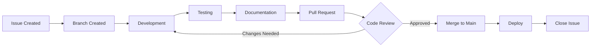

# Development Workflow: Ingestion → Digestion → Implementation

This guide outlines the logical process for moving ideas, research, and drafts through to production implementation in the Classroom RPG: Aetheria project.

## 🔄 The Three-Phase Process

### Phase 1: Ingestion 📥

**Purpose**: Capture and organize new ideas, research, and requirements.

**Activities**:
- Upload research documents to [`/research/`](../../research/)
- Create draft specifications in [`/drafts/`](../../drafts/)
- Document satellite project ideas in [`/satellites/`](../../satellites/)
- Collect user feedback and feature requests
- Gather competitive analysis and market research

**Outputs**:
- Research documents
- Draft PRDs and specifications
- Brainstorming notes
- User study results
- Technical explorations

**Best Practices**:
- Use clear, descriptive filenames with dates
- Include metadata (author, date, type, status)
- Link to related discussions or issues
- Tag with appropriate labels

### Phase 2: Digestion 🧠

**Purpose**: Review, analyze, and synthesize information into actionable items.

**Activities**:
- Team reviews documents in GitHub Discussions
- Analyze findings and identify patterns
- Prioritize features and improvements
- Break down large initiatives into manageable tasks
- Evaluate technical feasibility
- Assess resource requirements

**Outputs**:
- GitHub Issues for specific tasks
- Updated roadmap items
- Technical design documents
- Implementation plans
- Resource allocation decisions

**Review Process**:
1. **Initial Review** (within 1 week)
   - Assign reviewers
   - Discuss in team meeting or GitHub Discussions
   - Tag with appropriate labels

2. **Analysis** (1-2 weeks)
   - Deep dive into implications
   - Technical feasibility assessment
   - Resource estimation

3. **Decision** (by end of sprint)
   - Prioritize in backlog
   - Create implementation issues
   - Assign to milestone or release

**Tools**:
- GitHub Discussions for conversation
- GitHub Issues for tracking tasks
- Project boards for visualization
- Milestone planning for releases

### Phase 3: Implementation 🛠️

**Purpose**: Execute planned work and integrate into the main product.

**Activities**:
- Create feature branches
- Write code following standards
- Write tests
- Update documentation
- Code review via pull requests
- Merge to main branch

**Workflow**:



**Standards**:
- Follow [CONTRIBUTING.md](../../CONTRIBUTING.md) guidelines
- Use Conventional Commits
- Maintain test coverage
- Update relevant documentation
- Get peer review before merging

**Outputs**:
- Production code in `/src/`
- Updated documentation in `/docs/`
- Closed issues
- Release notes in CHANGELOG.md

## 📍 File Location Guide

### Where Should My File Go?

| Content Type | Location | Status |
|-------------|----------|---------|
| Research findings | `/research/` | Published |
| Draft specifications | `/drafts/` | In progress |
| Experimental code | `/drafts/feature-name/` | Exploratory |
| Satellite tools | `/satellites/tool-name/` | Independent |
| Production code | `/src/` | Merged |
| Official docs | `/docs/` | Published |
| Community docs | Root (README, CONTRIBUTING) | Published |

### Document Lifecycle

```
Idea/Draft → Review → Refinement → Approval → Implementation → Production
   ↓           ↓          ↓           ↓             ↓              ↓
/drafts/   Discussion   /drafts/   Issue       /src/         Release
                                  Created      Merged
```

## 🎯 Practical Examples

### Example 1: New Feature Request

**Ingestion**:
1. User suggests feature in GitHub Discussions
2. Maintainer creates draft PRD in `/drafts/features/new-quest-types.md`
3. Team member researches similar features → `/research/quest-systems-analysis.md`

**Digestion**:
1. Team reviews in weekly meeting
2. Creates GitHub Issue with requirements
3. Breaks down into subtasks
4. Assigns to next sprint milestone

**Implementation**:
1. Developer creates feature branch
2. Implements quest system changes in `/src/components/quests/`
3. Adds tests
4. Updates `/docs/features/quest-system.md`
5. Creates PR, gets review
6. Merges to main
7. Moves draft to `/drafts/archive/implemented/`

### Example 2: Research-Driven Improvement

**Ingestion**:
1. UX researcher uploads study: `/research/accessibility-audit-2025-12.md`
2. Findings show issues with color contrast

**Digestion**:
1. Team discusses in GitHub Discussions
2. Prioritizes as high importance
3. Creates issues for specific fixes
4. Updates design system documentation

**Implementation**:
1. Designer updates theme colors in `/src/styles/themes/`
2. Developer implements changes
3. QA tests with screen readers
4. Documents changes in CHANGELOG.md
5. Closes related issues

### Example 3: Satellite Project

**Ingestion**:
1. Team identifies need for automated video generation
2. Creates specification: `/drafts/satellites/video-production-spec.md`

**Digestion**:
1. Evaluates whether to build or buy
2. Decides to build custom solution
3. Plans architecture and tools
4. Creates project issue

**Implementation**:
1. Sets up `/satellites/video-production/` directory
2. Implements Python script and FFmpeg pipeline
3. Adds GitHub Actions workflow
4. Documents in satellite README
5. Moves spec to `/satellites/video-production/docs/`

## 🔧 Tools & Integration

### GitHub Features
- **Discussions**: For open-ended conversation (Digestion)
- **Issues**: For specific, actionable tasks (Digestion → Implementation)
- **Projects**: For visualizing workflow (All phases)
- **Pull Requests**: For code review (Implementation)
- **Actions**: For automation (Implementation)

### Labels
- `research` - Research documents
- `draft` - Draft specifications
- `needs-discussion` - Requires team input
- `ready-for-implementation` - Approved and specified
- `in-progress` - Currently being worked on
- `review-needed` - Awaiting code review

## 📋 Checklists

### Adding Research Document
- [ ] Research conducted and documented
- [ ] File uploaded to `/research/` with clear name
- [ ] README.md updated with entry
- [ ] Discussion created for team review
- [ ] Tagged with `research` label

### Moving from Draft to Implementation
- [ ] Draft reviewed and approved
- [ ] GitHub Issue created with requirements
- [ ] Technical design documented
- [ ] Assigned to milestone
- [ ] Implementation plan clear
- [ ] Ready for development

### Completing Implementation
- [ ] Code implemented and tested
- [ ] Documentation updated
- [ ] PR reviewed and approved
- [ ] Changes merged to main
- [ ] Issue closed
- [ ] CHANGELOG.md updated
- [ ] Draft archived or moved

## 🚀 Getting Started

1. **New to the project?** Read [CONTRIBUTING.md](../../CONTRIBUTING.md)
2. **Have research to share?** See [/research/README.md](../../research/README.md)
3. **Working on a draft?** See [/drafts/README.md](../../drafts/README.md)
4. **Building a satellite?** See [/satellites/README.md](../../satellites/README.md)

## 📞 Questions?

- Open a [GitHub Discussion](https://github.com/ivviiviivvi/classroom-rpg-aetheria/discussions)
- Check [SUPPORT.md](../../SUPPORT.md)
- Review [CONTRIBUTING.md](../../CONTRIBUTING.md)

---

**Remember**: The goal is to move systematically from ideas to implementation while maintaining quality and team alignment at each phase.
